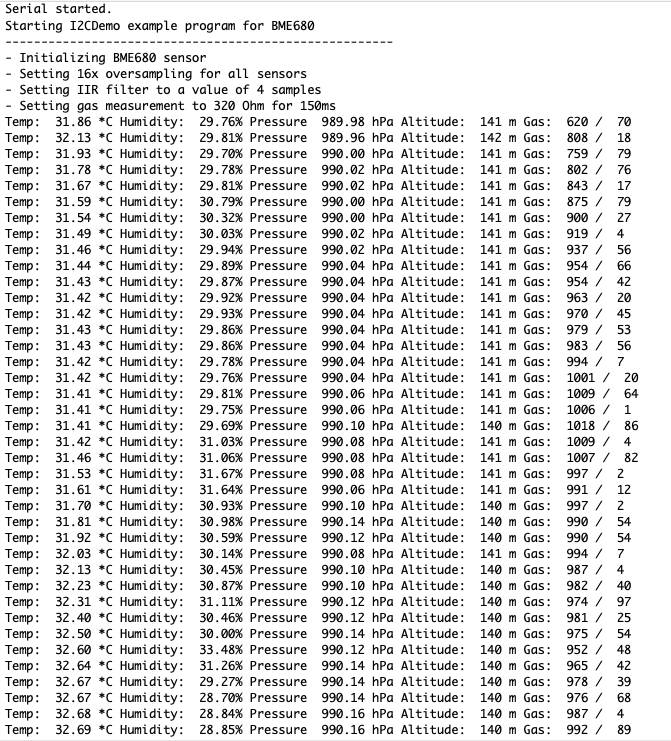

# RAK811_BME680

This sketch, modified from the examples of the Zanshin BME680 library, shows how to use the onboard BME680. It outputs the environment data on the serial terminal. Not very useful, but a a necessary step for the tracker.

## UPDATE

Added a `launch.sh` script that uploads the firmware to the board – convenient when you want to upload it to several boards. The firmware is also included.